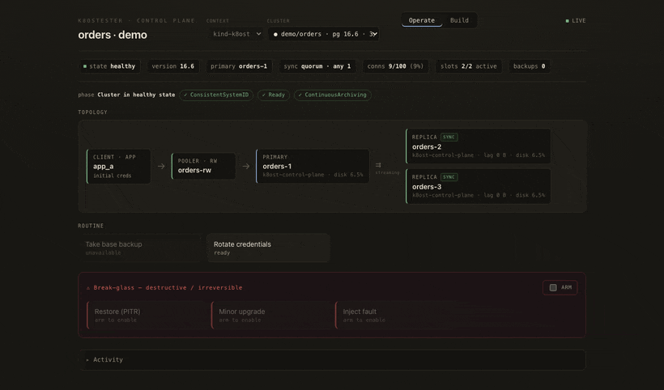

# K8osTester

[](https://github.com/erosas/k8ostester/actions/workflows/ci.yml)
[](https://github.com/erosas/k8ostester/actions/workflows/codeql.yml)
[](https://github.com/erosas/k8ostester/actions/workflows/ci.yml)
[](LICENSE)

Prove that a stateful Kubernetes configuration is **resilient** and **operable**.
Deploy a config under load, inject faults (kill/partition the primary, drop a
replica, drain a zone) or drive real operations (backup, credential rotation, PG
upgrade, PITR restore), and get a machine-checkable verdict from real,
app-perspective metrics. PostgreSQL / CloudNativePG first.

Two things ship here:

- **Experiments** — headless, linear chaos/operability scripts that produce a
  PASS/FAIL verdict from Prometheus. You run these against any cluster.
- **The control console** (`k8ost-console`) — a single-page web control plane
  that discovers a live CNPG cluster and lets you operate it, break-glass it, and
  build/deploy new clusters. Runs on your laptop against a kubeconfig, or
  in-cluster as a control plane.



*The console operating a live cluster through a failover. See the full
[visual tour](docs/tour.md).*

## How it's built

A small [uv workspace](https://docs.astral.sh/uv/concepts/projects/workspaces/) —
a thin kernel of primitives plus one vertical per technology. There is
deliberately **no generic framework**: verticals are direct, tech-specific
scripts on the kernel. See [docs/architecture-restructure.md](docs/architecture-restructure.md).

```
kernel/   primitives: k8s client, chaos (kill/partition/drain), SLO-query verdict,
          the Run helper, and a cluster capability probe
  console/  the shared, persistent Prometheus + Grafana (viewing + cross-run compare)
pg/       the PostgreSQL/CloudNativePG vertical
  src/k8ostester_pg/
    harness.py + slo.py            deploy the ideal config + the SLO checks
    server.py + console.html       the k8ost-console control plane (SPA + SSE)
    discover.py control.py execute.py ops.py builder.py dashboard.py   the console's guts
    resources/                     manifest + dashboard templates (${VAR} substitution)
  experiments/         linear experiment scripts (deploy → chaos → verify → verdict)
  testbed/             the production-readiness golden path (backup, rotate, upgrade, PITR)
  loadgen/             the k8os-loadgen image (the app-perspective load generator)
  deploy/              in-cluster manifests for the console (SA + RBAC + Deployment)
```

## Running it

Three independent ways to use it. All need Python ≥ 3.14 and `uv sync` once at the
repo root; the cluster-facing modes need a Kubernetes cluster with the
**[CloudNativePG](https://cloudnative-pg.io/) operator 1.26+** installed (the
manifests use `.spec.probes` and declarative synchronous replication; tested on
1.27, works through the current 1.30 — use a
[currently-supported release](https://cloudnative-pg.io/documentation/current/supported_releases/)).

### 1 · Run an experiment locally

A headless chaos/operability run against a cluster you have `kubectl` access to.
The experiment **self-deploys** the ideal config + load app into its own
namespace, injects the fault, verifies recovery, and prints a verdict. It needs
the shared console's Prometheus (from [`kernel/console`](kernel/console))
port-forwarded to `localhost:9090` for the SLO range-queries.

```bash
# one-time per cluster: the shared, persistent Prometheus + Grafana
kubectl apply -f kernel/console/prometheus.yaml
kubectl apply -f kernel/console/grafana.yaml            # optional (viewing / compare)
kubectl -n k8os-console port-forward svc/prometheus 9090:9090   # leave running

# a resilience experiment (deploy → kill the primary → verify → verdict)
uv run python pg/experiments/kill-primary/run.py --context my-ctx --prometheus http://localhost:9090

# the matched contrast — killing a replica should be a non-event (PASS)
uv run python pg/experiments/kill-replica/run.py --context my-ctx --prometheus http://localhost:9090
```

Exit code is `0` on PASS, `1` on FAIL. Each experiment leaves its namespace
(`exp-kill-primary`, …) behind for inspection — `kubectl delete ns exp-…` before
re-running. See [pg/README.md](pg/README.md).

### 2 · Run the control console against your kubeconfig

The console on your laptop, talking to whatever your kubeconfig points at. It
discovers every CNPG cluster the credentials can see; pick one in the UI, or
pre-select it with flags.

```bash
uv run --directory pg k8ost-console                     # pick context + cluster in the UI
uv run --directory pg k8ost-console --context my-ctx --namespace demo --cluster orders   # pre-select
# → open http://127.0.0.1:8700   (binds localhost only)
```

Optional flags: `--grafana <url>` (deep-links to your dashboards), `--target `
(offer a specific PG image as an upgrade), `--port` / `--host`.

### 3 · Deploy the console in-cluster (control plane)

The same image runs **in the cluster** as a control plane. In a pod it uses its
mounted **ServiceAccount** (no kubeconfig) and execs into pods over the API
stream. RBAC is the blast radius; `port-forward` is the auth gate (no ingress).

```bash
# build from the repo root (the image needs both workspace members)
docker build -f pg/console.Dockerfile -t <your-repo>/k8os-console:<tag> .
docker push <your-repo>/k8os-console:<tag>

# set image: in pg/deploy/console.yaml, then apply into the target namespace
kubectl -n <ns> apply -f pg/deploy/console.yaml
kubectl -n <ns> apply -f pg/deploy/console-lab.yaml     # optional: enables Build → Deploy
kubectl -n <ns> port-forward svc/k8ost-console 8700:8700
# → open http://127.0.0.1:8700
```

For fleet-wide (all-namespace) control, use `pg/deploy/rbac-clusterwide.yaml`
instead of the namespaced Role. Full walk-through in
[docs/remote-control.md](docs/remote-control.md).

### Also: the production-readiness testbed

A self-provisioning golden path (deploy → backup → rotate → upgrade → PITR → verify)
that stands up its own operator + monitoring:

```bash
uv run python pg/testbed/flow.py --context my-ctx --keep
```

See [pg/testbed/README.md](pg/testbed/README.md).

## The model

An **experiment** is a linear script that reads top to bottom:

```python
harness.deploy_ideal_config(k8s, NS, EXPERIMENT)   # config + app + healthy
chaos.kill_pod(k8s, NS, primary)                    # a kernel primitive
run.verify("primary_moved", ...)                    # correctness (data compare)
verdict = run.verdict(fetch, default_checks(EXPERIMENT))   # + SLO range-queries
```

The **verdict** = correctness verify-steps (RPO, integrity, PITR) **and** SLO
checks evaluated as Prometheus range queries over the run window (error rate,
latency, availability — averaged, so a sub-second blip is not an outage). Live
viewing and **cross-run comparison** happen in Grafana over the shared, persistent
Prometheus (each run's metrics are labelled by `experiment`/`run` and outlive it).

## Images

Two published images (multi-arch, on a version tag — see
[.github/workflows/release.yml](.github/workflows/release.yml)):

| Image | What it is | Override |
| --- | --- | --- |
| [`bytestream89/k8os-loadgen`](https://hub.docker.com/r/bytestream89/k8os-loadgen) | the app-perspective load generator (python + psycopg) | the app manifest / `K8OST_LOADGEN_IMAGE` |
| [`bytestream89/k8os-console`](https://hub.docker.com/r/bytestream89/k8os-console) | the `k8ost-console` control plane (kernel + pg vertical) | `image:` in `pg/deploy/console.yaml` |

Built on a minimal [Chainguard Wolfi](https://github.com/wolfi-dev) base
(continuously rebuilt → ~0 CVEs), with an SBOM + provenance. Behind a proxy,
mirror them and point the manifests at your registry.

## Docs

- **[docs/tour.md](docs/tour.md)** — a visual tour of the console (screenshots + live failover)
- **[docs/architecture-restructure.md](docs/architecture-restructure.md)** — the kernel + verticals design record
- **[docs/productionization.md](docs/productionization.md)** — the testbed golden path
- **[docs/remote-control.md](docs/remote-control.md)** — the `k8ost-console` control plane

## Develop

```bash
uv sync
uv run ruff check .
uv run --directory kernel pytest
uv run --directory pg pytest
```

MIT licensed.
