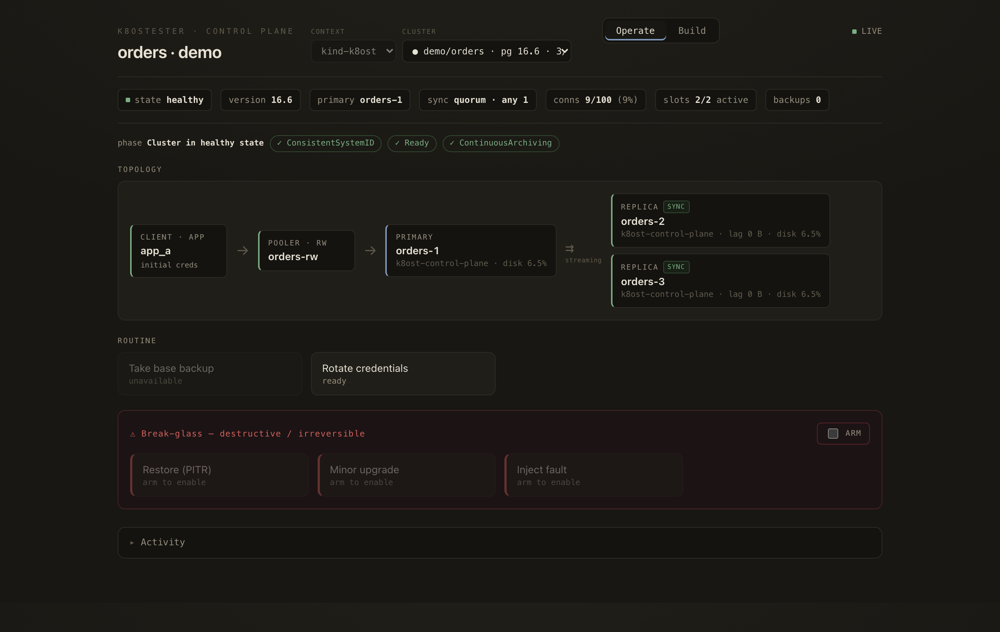
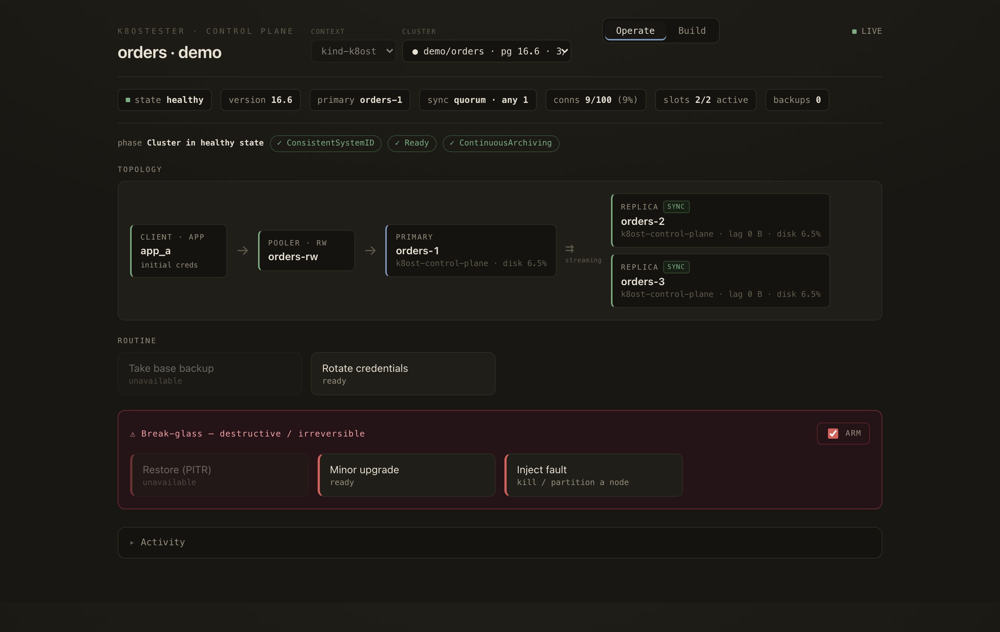
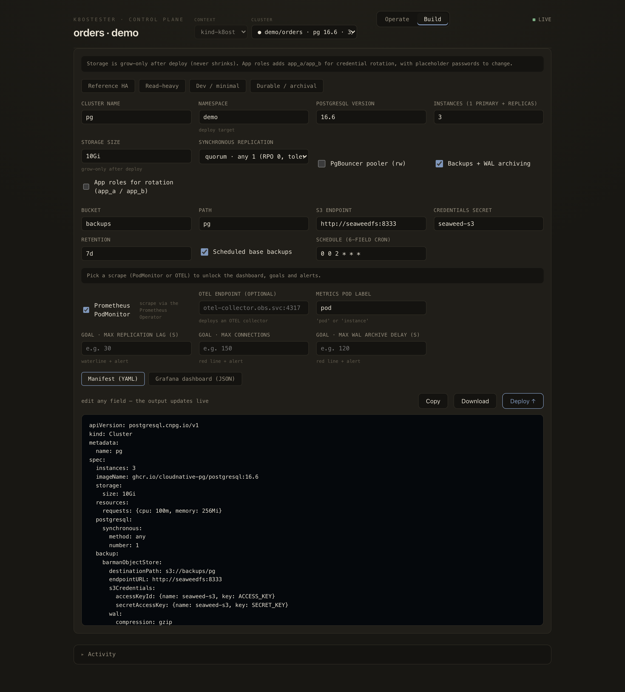

# A visual tour of the console

A quick look at `k8ost-console` operating a real CloudNativePG cluster. Every
image here is captured from a live cluster by [`docs/tour/capture.sh`](tour/capture.sh)
— re-run it to regenerate them after a UI change (see [Regenerating](#regenerating)).

## Live failover

Kill the primary and watch it happen: the cluster goes `degraded`, CNPG promotes
a sync replica, and it settles back to `3/3` — all reflected live over the SSE
stream, no refresh.


## Operate

The live view of one cluster. A status strip (state, version, primary, sync
policy, connection saturation, replication slots, backups) sits above the CNPG
conditions and the **topology**: `client → pooler → primary → replicas`, each
replica badged SYNC/ASYNC with its lag, node, and disk headroom. Below are the
routine actions, enabled only when their precondition holds against the live
snapshot.



## Break-glass (armed)

The destructive actions — PITR restore, minor upgrade, inject a fault — live in a
cordoned danger zone that stays disabled until you flip **ARM**. Here it's armed:
the zone lights up and the actions enable, except Restore, which stays
`unavailable` because this cluster has no completed backup yet. Each action still
confirms before it runs.



## Build

Design a cluster from a few choices — instances, sync policy, storage, pooler,
backups, app roles, observability — and the manifest (or the matching Grafana
dashboard) renders live as you type. Copy it, download it, or **Deploy** it
straight into the selected namespace.



## Regenerating

The screenshots and GIF are produced from a running console, so they never drift
from a mockup:

```bash
# 1. a cluster to look at (any CNPG cluster works; this is the local demo)
uv run --directory pg k8ost-console --context <ctx> --namespace <ns> --cluster <name>

# 2. capture (drives the UI over the DevTools protocol; triggers a real failover)
TOUR_CONTEXT=<ctx> TOUR_NS=<ns> TOUR_CLUSTER=<name> bash docs/tour/capture.sh
```

Prereqs: Google Chrome, [`gifski`](https://gif.ski/), Node ≥ 21, `kubectl`. The
capture **kills the primary** to film the failover — point it at a throwaway
cluster, not production.
